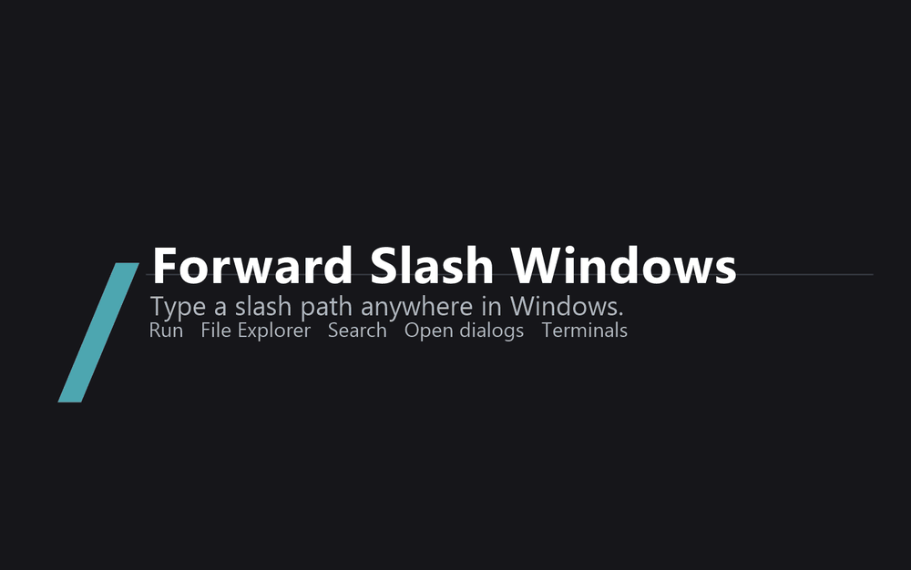

# fwdslash

**Type Linux paths in Windows.** `/etc/apt` in the File Explorer address bar opens `\\wsl.localhost\Ubuntu\etc\apt`.

[](https://opensource.org/licenses/MIT)


[](https://github.com/faratech/fwdslash/stargazers)

<p align="center">
  
</p>

---

## Why fwdslash?

You know where the file is. You just can't type it. `\\wsl.localhost\Ubuntu\...` is fine in a script and miserable in an address bar, so type the path you were thinking of instead.

- **Works where you already navigate** — File Explorer, Win+R, Windows Search, Open/Save dialogs
- **No driver, no admin** — per-user, reversible, no Explorer restart
- **Terminals too, if you want** — `dir`, `ls` and `cd` take slash paths in Command Prompt and PowerShell
- **Fails safely** — a typo is blocked with an explanation instead of becoming a web search
- **Stays out of the way** — pause it from the tray icon
- **No telemetry, no account** — the Store build makes no network connections

---

## Where it works

| Surface | Type this |
|---------|-----------|
| File Explorer address bar | `/etc/apt` |
| Run (Win+R) | `/usr/share` |
| Windows Search | `/etc` |
| Open / Save dialogs | `/home/alice` |
| Command Prompt&nbsp;* | `dir /etc/apt` · `cd /Ubuntu` |
| PowerShell 5.1 / 7&nbsp;* | `ls /usr` · `cd /Ubuntu` |

<sub>* optional adapters, off by default</sub>

---

## Paths

```text
/Ubuntu                 →  \\wsl.localhost\Ubuntu
/Ubuntu/home/alice      →  \\wsl.localhost\Ubuntu\home\alice
```

Bare `/` lists your distributions and never silently picks one. Prefer a default? Then plain Linux paths work unprefixed:

```powershell
fwdslash bare-slash default          # follow `wsl --set-default`
fwdslash bare-slash default Ubuntu   # or pin one
```

```text
/etc/apt                →  \\wsl.localhost\Ubuntu\etc\apt
```

Or point `/` at any folder at all — WSL not required:

```powershell
fwdslash bare-slash root C:\code                            # / becomes C:\code
fwdslash bare-slash root \\wsl.localhost\Ubuntu\home\me   # or a folder inside a distro
fwdslash bare-slash root                                    # clear it
```

```text
/                →  C:\code
/proj/build      →  C:\code\proj\build
/Ubuntu/home     →  still the distribution
```

A registered distribution always wins over a same-named folder.

---

## Install

**Requires Windows 11.** WSL is optional: `/Ubuntu/...` paths and default-distribution mode need a registered distribution; a custom `/` root works with none.

### Microsoft Store (recommended)

[**Get it from the Microsoft Store**](https://apps.microsoft.com/detail/9P51CM0MTMK2) — Store ID `9P51CM0MTMK2`. The Store handles the Windows App Runtime dependency and updates.

### GitHub

One line, no administrator rights; the release is signed with a publicly trusted certificate:

```powershell
powershell -ExecutionPolicy Bypass -File Install-fwdslash.ps1
```

It fetches the latest signed `.msixbundle`, installs the [Windows App Runtime 2.x](https://learn.microsoft.com/windows/apps/windows-app-sdk/downloads) if missing, and registers the package for the current user. This build checks GitHub for updates daily (switchable in Settings).

Pick one flavor. Both register the same startup task and `fwdslash` alias, so only one broker survives a logon with both installed; the script refuses to install over a Store install unless you pass `-Force`.

Each release also carries a `fwdslash-<version>-store-unsigned.msixbundle`. **That one is not installable** — it is the Microsoft Store submission artifact: the same binaries under the Partner Center package identity, left unsigned because the Store re-signs what it accepts, and published only so the Store submission is reproducible from the release. Install the plain `.msixbundle`, or get the Store build from the listing above.

### Build from source

```powershell
cargo build --release --target aarch64-pc-windows-msvc --workspace   # x86_64-pc-windows-msvc on Intel/AMD
.\target\aarch64-pc-windows-msvc\release\fwdslash.exe install
```

An unpackaged build needs the Windows App Runtime 2.x installed separately.

### Uninstall

```powershell
fwdslash uninstall
```

Removing the package from Settings > Apps runs no code (an uninstalling MSIX never does), so the leftover shell hooks clean themselves up on the **next shell launch** instead: the first PowerShell or Command Prompt window you open afterward removes every fwdslash profile block and cmd `AutoRun` entry (restoring what was there before, or refusing if you changed it since), deletes the `HKCU\Software\ForwardSlashWindows` keys, and clears the `%LOCALAPPDATA%\ForwardSlashWindows` payload — silently, unless there is an error you need to act on. The payload directory itself goes a few seconds later, through a one-shot scheduled task, because the cleanup is running from inside it.

Turning the terminal integrations off in the settings app first is still the tidy path, and it takes effect immediately.

**With Controlled Folder Access on:** the self-clean writes to your `Documents` folder, so it can only remove the profile blocks if the staged controller (`%LOCALAPPDATA%\ForwardSlashWindows\PowerShell\<version>\fwdslash.exe`) is allowed through Controlled folder access. If it is not, the guarded block stays in place — harmlessly and silently, since it only imports a module that is still there or does nothing at all — and you can remove it by hand or by allowing that executable. Turning the integrations off *before* uninstalling avoids the situation entirely.

---

## Terminals

Shells parse `/` before the filesystem sees it (`cmd.exe` reads it as a switch), so terminal support is an opt-in adapter:

```powershell
fwdslash integration cmd enable
fwdslash integration windows-powershell enable
fwdslash integration powershell enable
```

Each adapter records what it replaced, restores it byte-for-byte when turned off, and refuses to overwrite anything another program changed since. Open a **new** shell afterwards.

**PowerShell execution policy.** The PowerShell adapters work by adding a guarded block to your `profile.ps1`, so the edition's execution policy has to let local scripts run. Windows PowerShell 5.1 ships **Restricted** on Windows client editions; PowerShell 7 ships RemoteSigned.

| Effective policy | PowerShell adapter |
|---|---|
| `RemoteSigned`, `Unrestricted`, `Bypass` | works |
| `Restricted`, `Undefined` | blocked — `fwdslash` refuses **before changing anything** and prints the one-line fix |
| `AllSigned` | unsupported — your own `profile.ps1` would need an Authenticode signature that no installer can give it |

The fix, run in the edition you are enabling (the policy is per edition):

```powershell
Set-ExecutionPolicy -Scope CurrentUser RemoteSigned
```

`fwdslash doctor` and `fwdslash integrations` report each edition's effective policy, and the settings app shows the same guidance when an enable fails. The module the adapter deploys is Authenticode-signed in the release builds, but that is integrity only: it does not change the Restricted case (nothing runs at all there) and does not make AllSigned usable.

With an adapter on, `dir`/`ls` and `cd` both take slash paths:

```text
cmd          cd /Ubuntu/etc     chdir /Ubuntu     pushd /Ubuntu   (cd /d /Ubuntu too)
PowerShell   cd /Ubuntu/etc     chdir  sl  pushd
```

Notes: `cmd.exe` cannot make a UNC path current, so its adapter enters the target with `pushd` (a temporary drive letter released by `popd`). DIR's own switches (`dir /b`, `dir /s`, `dir /a:d`) stay native. In PowerShell a slash path the resolver rejects reports the resolver's message rather than landing on the current drive, so use `cd \Windows` for `C:\Windows`.

Without an adapter, these always work:

```powershell
fwdslash list /Ubuntu/etc
fwdslash open /Ubuntu/home
fwdslash resolve /etc/apt
```

---

## Commands

```text
fwdslash status [--json]          Broker, distributions, and driver state
fwdslash resolve /Distro/path     Print the resolved UNC path
fwdslash open|list /Distro/path   Open in Explorer, or list to stdout
fwdslash cmd-list /path           Shell adapter DIR (exit 3 = run native DIR)
fwdslash cmd-cd /path             Directory for the cmd CD/PUSHD macros
fwdslash shell-resolve /path      One JSON line for the PowerShell module
fwdslash doctor /path | --all     Diagnose a path
fwdslash bare-slash [list|default [Distro]]
fwdslash bare-slash root <WindowsPath>
fwdslash integrations [--json]
fwdslash integration <name> enable|disable
fwdslash pause | resume           Pause resolution, keep integrations
fwdslash settings [section]       Open the settings app
fwdslash start | stop | install | uninstall
fwdslash version                  Print the running version
```

---

## Settings

One notification-area icon, owned by the resident broker. Left click opens the settings window; right click offers **Enabled**, **Open WSL root**, **Open distribution** (one entry per distribution), **Integrations**, and **Exit**. Closing the settings window closes only the window; the broker keeps running.

Each integration is independent, and turning one off runs its reversible uninstall. The **Disable** switch pauses resolution without forgetting what you installed. Adapters left behind by an older release are upgraded automatically, by the broker at start and by the settings window on launch. The About page shows the broker state, each adapter's payload version, and the package version and flavor.

---

## Tests

```powershell
cargo test -p fsw-path -p fsw-core                              # resolver + registry contract (runs on Linux/WSL too)
cargo test -p fwdslash --bins --target x86_64-pc-windows-msvc   # shell adapters
.\tools\Test-Sandbox.ps1                                        # lifecycle smoke test
```

---

## Filesystem driver

`driver/` holds an optional minifilter that would extend `/Ubuntu/...` paths to every Windows filesystem API (PowerShell, .NET, Python). It is **not part of any release**.

> **Do not load the unsigned driver on a physical machine.** Build and test it only in a checkpointed Hyper-V guest; [`docs/driver-lab.md`](docs/driver-lab.md) is the runbook. See also [`SECURITY.md`](SECURITY.md) and [`docs/compatibility.md`](docs/compatibility.md).

---

## Docs

- [`docs/architecture.md`](docs/architecture.md) — trust boundaries and design
- [`docs/compatibility.md`](docs/compatibility.md) — what's verified, and what isn't
- [`PRIVACY.md`](PRIVACY.md) — no data collected; the Store build makes no network calls, the GitHub build checks for updates

---

## License

MIT — see [LICENSE](LICENSE). By Mike Fara, Fara Technologies LLC, New York.

<p align="center">
  <b>Star this repo if you find it useful!</b><br>
  <a href="https://github.com/faratech/fwdslash">https://github.com/faratech/fwdslash</a>
</p>

<p align="center">
  <a href="https://apps.microsoft.com/detail/9P51CM0MTMK2?mode=direct">
    <picture>
      <source media="(prefers-color-scheme: light)" srcset="https://get.microsoft.com/images/en-us%20light.svg">
      
    </picture>
  </a><br>
  <sub>Available on the Microsoft Store as <b>fwdslash</b> — Store ID <code>9P51CM0MTMK2</code></sub>
</p>
